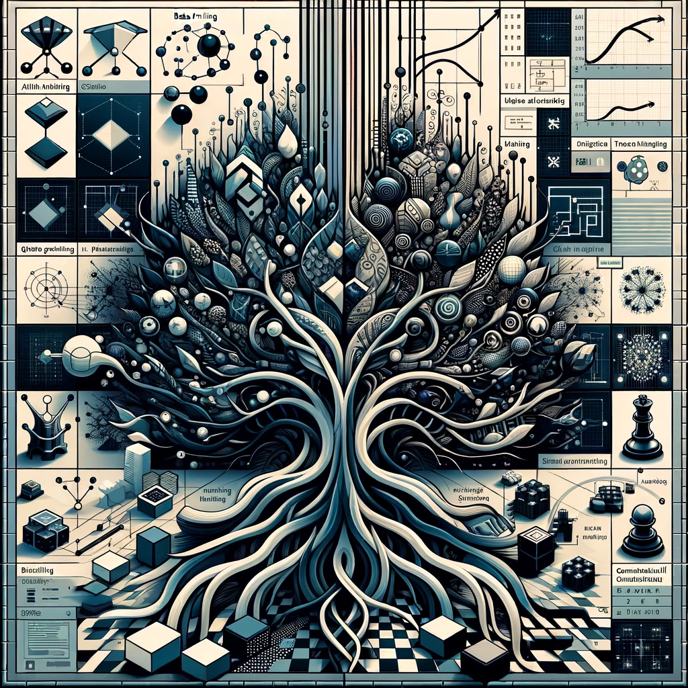

# ¡Hola! Bienvenid@ 👋

  

---

## 👨‍💻 Sobre mí

Desarrollador especializado en Machine Learning, IA, teoría de juegos y programación creativa. Me gustan los problemas complejos relacionados con sistemas, optimización, decisiones estratégicas, y desarollo de aplicaciones basadas en LLMs.

---

## 🌐 Webs

- **[Python-Lair 🐍](https://python-lair.space/)**:  
Espacio dedicado de tutoriales, experimentos y proyectos personales en Python.

- **[Geometría Áurea 🎨](https://geometria-aurea.replit.app/)**:  
Exploración artística inspirada en el trabajo geométrico y visual de mi padre.

---

## 📫 Contacto

Estoy abierto a colaboraciones y discusiones interesantes. Puedes contactarme a través de:

- Instagram: [@geometria_aurea](https://www.instagram.com/geometria_aurea/)
- GitHub: [@MrCabss69](https://github.com/MrCabss69)
- CodeWars:[@Fever69](https://www.codewars.com/users/Fever69)

---

## Tecnologías

